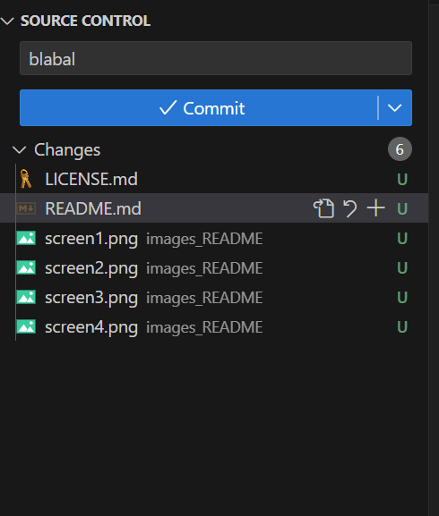
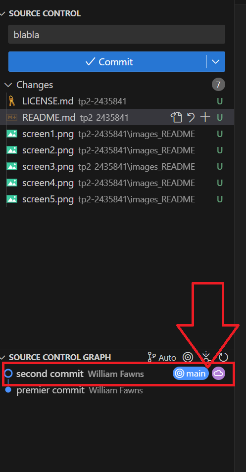
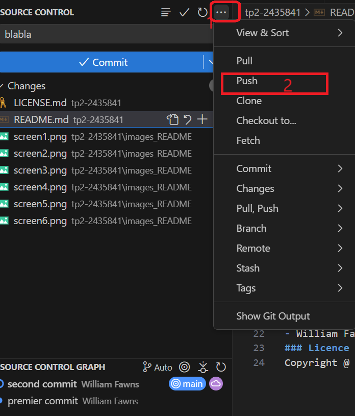

# Travail Pratique 2 
Ce dépôt contient le code d'un proket web fait dans le cours de Perspective Professionnelles.
## Faire un commit et un push dans Visual Studio Code
Voici comment faire un changement sur ce projet, et l'envoyer sur GitHub.
1. Mettre un message dans la section message (très important)
2. Envoyer le commit et vérifier s'il y a écrit main et avec l'image du nuage .
3. Appuyer sur les 3 petis points et Push 

## Contributeurs
- William Fawns - Auteur principal 
### Licence
Copyright @ 2024 William Fawn. Tous droits réservés.